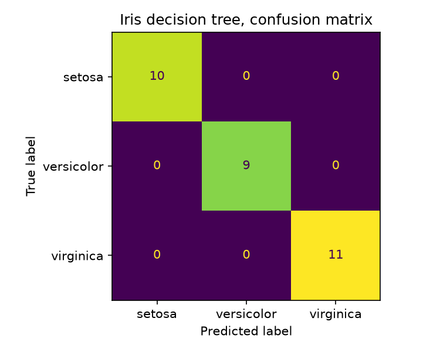

# Iris Classifier (Decision Tree)

## Overview

An end-to-end machine learning example built for the AI Fundamentals course. It trains a decision tree classifier on the classic Iris dataset using scikit-learn, evaluates the result, and saves a confusion matrix figure.

## Quick start

Windows PowerShell:

    git clone https://github.com/ryancl798-mise/iris-classifier.git
    cd iris-classifier
    python -m venv venv
    venv\Scripts\Activate.ps1
    pip install -r requirements.txt
    python src\train.py

macOS and Linux:

    git clone https://github.com/ryancl798-mise/iris-classifier.git
    cd iris-classifier
    python -m venv venv
    source venv/bin/activate
    pip install -r requirements.txt
    python src/train.py

## Results

The model classifies all 30 flowers in the held-out test set correctly, giving 100 per cent accuracy. Precision, recall and f1-score are 1.00 for all three species. The test set is small, so this tells you the problem is easy rather than that the model is flawless.

## Project structure

    data/         empty, Iris loads from scikit-learn
    notebooks/    iris_model.ipynb, the walk-through
    src/          train.py, the reproducible script
    tests/        test_train.py
    outputs/      confusion_matrix.png and model.joblib, written by train.py

## License

MIT
